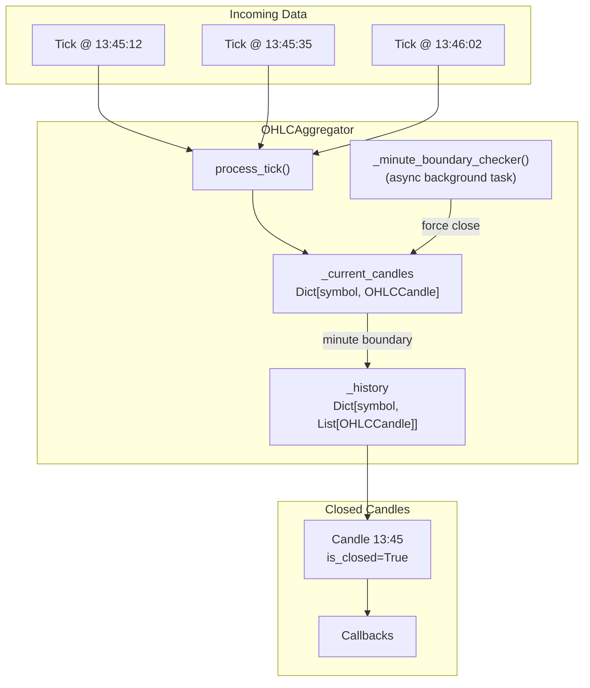
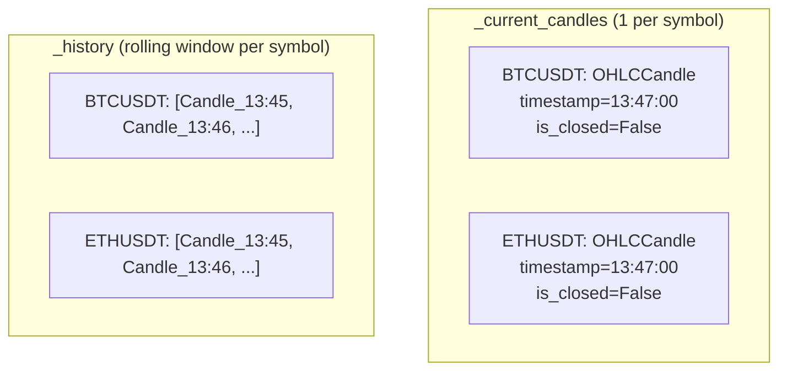
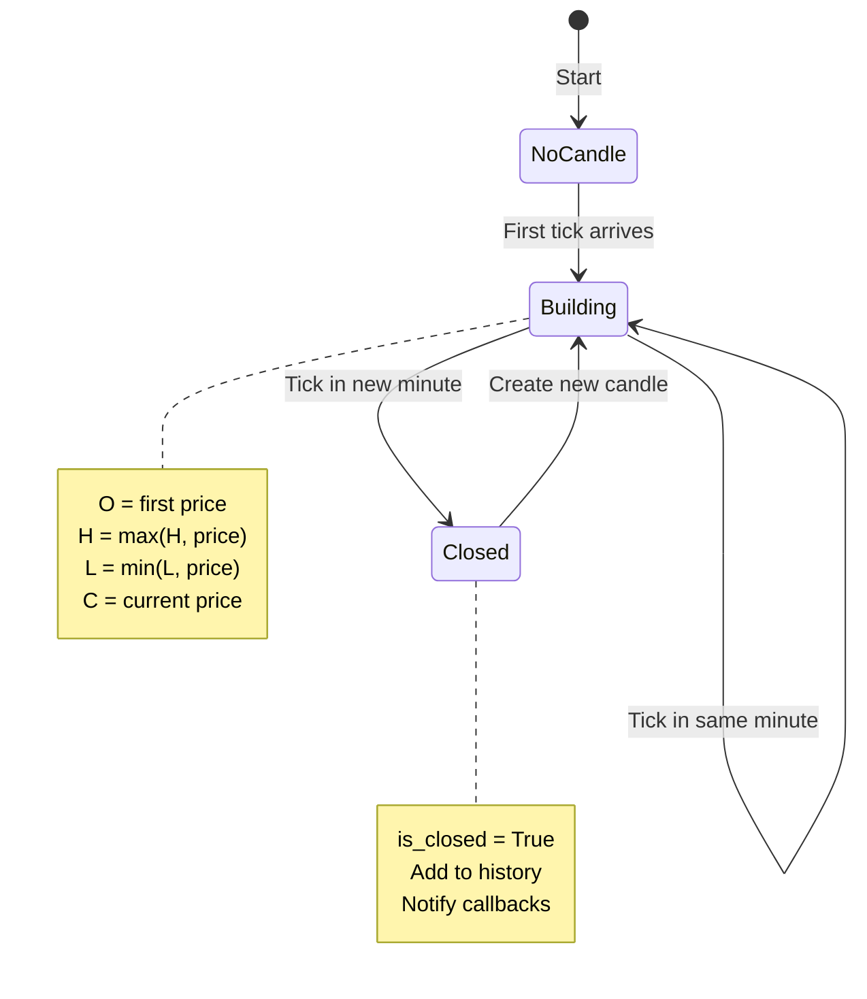
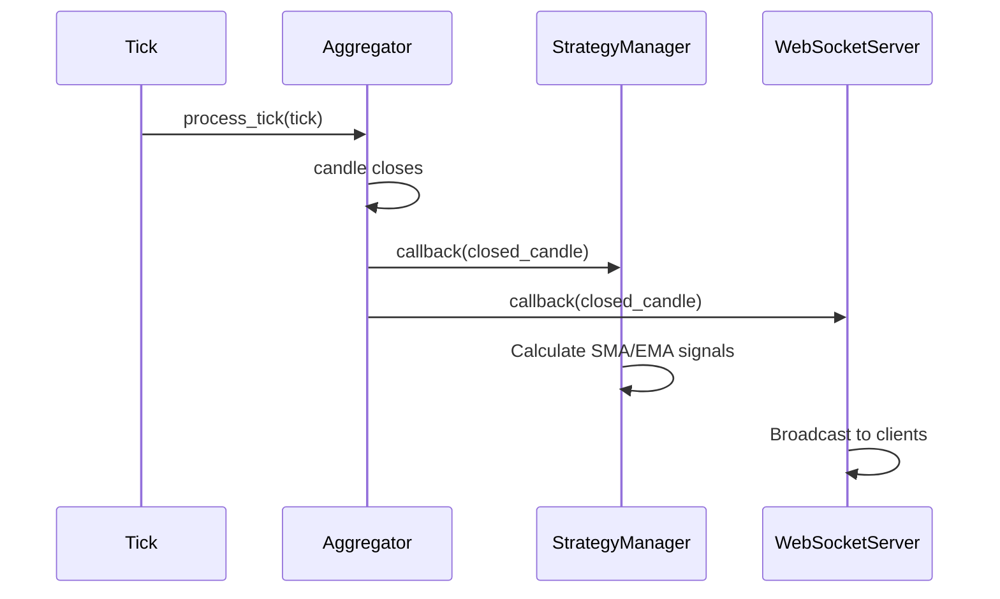
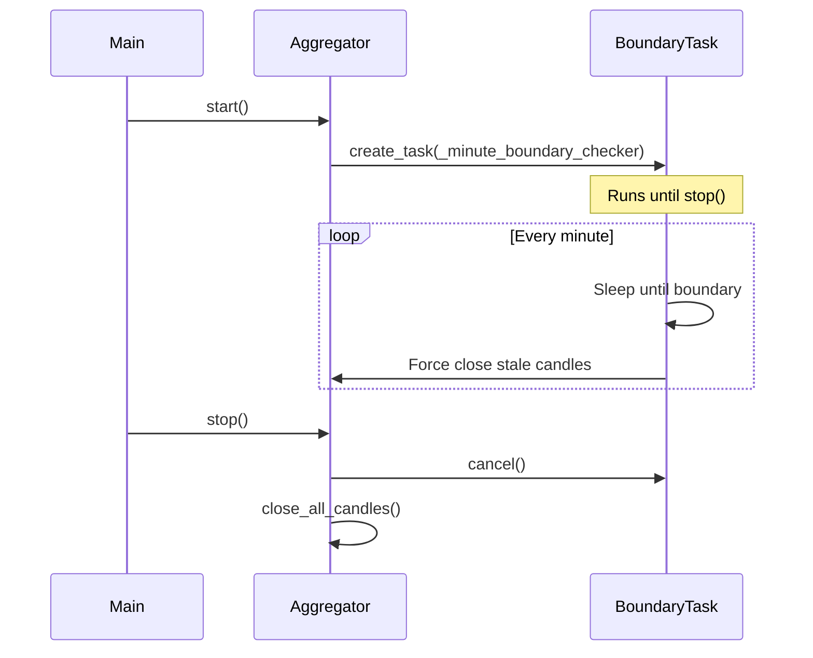

# 1-Minute OHLC Aggregation - Deep Technical Documentation

## ✅ Implementation Status: COMPLETE

Yes, the 1-Minute OHLC Aggregation has been **fully implemented**. This document provides an in-depth technical explanation of the architecture, algorithms, and implementation details.

---

## 📁 File Locations

| Component | File Path |
|-----------|-----------|
| OHLC Aggregator | `aggregation/ohlc_aggregator.py` |
| Data Models | `aggregation/models.py` |
| Configuration | `config.py` |

---

## 🏗️ Architecture Overview



---

## 1️⃣ OHLCCandle Model - Candle Data Structure

### Location
```
aggregation/models.py
```

### Data Structure

```python
@dataclass
class OHLCCandle:
    symbol: str          # Trading pair (e.g., "BTCUSDT")
    open: float          # First price in the minute
    high: float          # Maximum price in the minute
    low: float           # Minimum price in the minute
    close: float         # Last price in the minute
    timestamp: datetime  # Minute-boundary start time (e.g., 13:45:00)
    volume: float = 0.0  # Total traded volume
    tick_count: int = 0  # Number of ticks aggregated
    is_closed: bool = False  # Finalization flag
```

### Key Technical Features

#### 1.1 Factory Method for Tick-Based Creation

```python
@classmethod
def from_tick(cls, tick: Tick, candle_timestamp: datetime) -> "OHLCCandle":
    return cls(
        symbol=tick.symbol,
        open=tick.price,
        high=tick.price,
        low=tick.price,
        close=tick.price,
        timestamp=candle_timestamp,  # Floored to minute
        volume=tick.quantity,
        tick_count=1,
        is_closed=False
    )
```

**Technical Insight:**  
When a candle is created from the first tick:
- **O = H = L = C** = first tick's price
- **volume** = first tick's quantity
- **tick_count** = 1

#### 1.2 Incremental Update Algorithm

```python
def update(self, tick: Tick) -> None:
    if not self.is_closed:
        self.high = max(self.high, tick.price)   # Track maximum
        self.low = min(self.low, tick.price)     # Track minimum
        self.close = tick.price                   # Always update close
        self.volume += tick.quantity              # Accumulate volume
        self.tick_count += 1                      # Count ticks
```

**Time Complexity:** O(1) per tick update  
**Space Complexity:** O(1) - only scalar updates

---

## 2️⃣ OHLCAggregator - Real-Time Candle Builder

### Location
```
aggregation/ohlc_aggregator.py
```

### Core Data Structures

```python
class OHLCAggregator:
    def __init__(self, history_size: Optional[int] = None):
        self._current_candles: Dict[str, OHLCCandle] = {}      # Building candles
        self._history: Dict[str, List[OHLCCandle]] = defaultdict(list)  # Closed candles
        self._lock = threading.RLock()                          # Thread safety
        self._candle_callbacks: List[Callable] = []             # Observer pattern
        self._history_size = history_size or 100                # Rolling window
```

### Memory Layout



---

## 3️⃣ Minute Boundary Calculation

### The Critical Function

```python
def _get_candle_timestamp(self, tick_time: datetime) -> datetime:
    return tick_time.replace(second=0, microsecond=0)
```

### How It Works

| Tick Timestamp | Candle Timestamp |
|---------------|------------------|
| `13:45:12.345` | `13:45:00.000` |
| `13:45:59.999` | `13:45:00.000` |
| `13:46:00.001` | `13:46:00.000` |

**Technical Insight:**  
The `replace()` method zeros out seconds and microseconds, effectively performing a **floor operation** to the nearest minute.

```
Tick:   |----x----x--x------|----x-x---x-----x--|
              13:45:xx              13:46:xx
        
Candle: [====13:45:00======][====13:46:00======]
```

---

## 4️⃣ Tick Processing Algorithm

### process_tick() Flow

```python
def process_tick(self, tick: Tick) -> Optional[OHLCCandle]:
    with self._lock:
        symbol = tick.symbol.upper()
        candle_timestamp = self._get_candle_timestamp(tick.timestamp)
        
        current_candle = self._current_candles.get(symbol)
        closed_candle = None
        
        if current_candle is None:
            # Case 1: No existing candle → Create new
            self._current_candles[symbol] = OHLCCandle.from_tick(tick, candle_timestamp)
            
        elif current_candle.timestamp < candle_timestamp:
            # Case 2: Tick in new minute → Close old, create new
            closed_candle = self._close_candle(symbol)
            self._current_candles[symbol] = OHLCCandle.from_tick(tick, candle_timestamp)
            
        else:
            # Case 3: Same minute → Update existing
            current_candle.update(tick)
        
        return closed_candle
```

### State Machine Diagram



---

## 5️⃣ Minute Boundary Enforcement

### The Background Task

```python
async def _minute_boundary_checker(self) -> None:
    while self._running:
        # Calculate sleep time until next minute + 100ms buffer
        now = datetime.utcnow()
        next_minute = (now + timedelta(minutes=1)).replace(second=0, microsecond=0)
        sleep_time = (next_minute - now).total_seconds() + 0.1
        
        await asyncio.sleep(sleep_time)
        
        # Force-close any candles from previous minutes
        current_timestamp = self._get_candle_timestamp(datetime.utcnow())
        
        with self._lock:
            for symbol in list(self._current_candles.keys()):
                candle = self._current_candles.get(symbol)
                if candle and candle.timestamp < current_timestamp:
                    self._close_candle(symbol)
                    del self._current_candles[symbol]
```

### Why This Is Necessary

**Problem:** If no ticks arrive for a symbol after 13:45:30, the 13:45 candle would never close.

**Solution:** Background task wakes up at each minute boundary and force-closes stale candles.

```
Timeline:
─────────────────────────────────────────────────────────
13:45:00    13:45:30 (last tick)    13:46:00.1 (boundary check)
    │           │                        │
    └───────────┘                        └── Force close 13:45 candle
        Candle building                      even though no new tick
```

### Sleep Time Calculation

```python
# At 13:45:42.123:
now = datetime(2026, 2, 3, 13, 45, 42, 123000)
next_minute = datetime(2026, 2, 3, 13, 46, 0, 0)  # 13:46:00.000
sleep_time = (17.877) + 0.1 = 17.977 seconds
```

The **100ms buffer** (`+ 0.1`) ensures the check runs *after* the boundary, not at the exact boundary moment.

---

## 6️⃣ Candle Closing and History Management

### _close_candle() Implementation

```python
def _close_candle(self, symbol: str) -> Optional[OHLCCandle]:
    candle = self._current_candles.get(symbol)
    if candle:
        # 1. Mark as finalized
        candle.is_closed = True
        
        # 2. Add to rolling history
        self._history[symbol].append(candle)
        
        # 3. Trim to max size (FIFO eviction)
        if len(self._history[symbol]) > self._history_size:
            self._history[symbol] = self._history[symbol][-self._history_size:]
        
        # 4. Log the closed candle
        logger.info(
            f"Closed candle for {symbol}: "
            f"O={candle.open:.2f} H={candle.high:.2f} "
            f"L={candle.low:.2f} C={candle.close:.2f} "
            f"V={candle.volume:.4f} Ticks={candle.tick_count}"
        )
        
        # 5. Notify all registered callbacks
        for callback in self._candle_callbacks:
            callback(candle)
        
        return candle
    return None
```

### Rolling History (FIFO)

```
history_size = 100

Before: [C1, C2, C3, ..., C99, C100]  (100 candles)
After adding C101: [C2, C3, ..., C100, C101]  (oldest evicted)
```

**Implementation:**
```python
self._history[symbol] = self._history[symbol][-self._history_size:]
```

This slice keeps only the **last N** elements, effectively implementing FIFO eviction.

---

## 7️⃣ Thread Safety Guarantees

### RLock Usage Pattern

```python
with self._lock:
    # All reads and writes to _current_candles and _history
    # are protected by reentrant lock
```

**Why RLock (Reentrant Lock)?**
- The `_close_candle()` method may be called from within `process_tick()` which already holds the lock
- Standard `Lock` would deadlock in this scenario
- `RLock` allows same thread to re-acquire

### Critical Sections

| Method | Lock Scope | Reason |
|--------|-----------|--------|
| `process_tick()` | Full method | Protects candle state transitions |
| `_close_candle()` | Called within locked context | Called from `process_tick()` |
| `get_history()` | Full method | Returns consistent snapshot |
| `get_current_candle()` | Full method | Prevents torn reads |

---

## 8️⃣ Callback/Observer Pattern

### Registration

```python
# In main.py
self.ohlc_aggregator.add_candle_callback(self._on_candle)
self.ohlc_aggregator.add_candle_callback(self.ws_server.on_candle)
```

### Invocation Flow



---

## 9️⃣ Configuration

### Default Settings (config.py)

```python
candle_history_size: int = 100  # Retain 100 candles per symbol
```

### Memory Impact

| Symbols | History Size | Approx. Memory |
|---------|-------------|----------------|
| 2 | 100 | ~40 KB |
| 10 | 100 | ~200 KB |
| 50 | 1000 | ~10 MB |

*Each OHLCCandle is approximately 200 bytes*

---

## 🔟 Integration with Downstream Components

### In main.py

```python
class CryptoTradingSystem:
    def __init__(self):
        self.ohlc_aggregator = OHLCAggregator()
        
    def _setup_callbacks(self):
        # Tick → OHLC Aggregator
        self.stream_client.add_tick_callback(self.ohlc_aggregator.process_tick)
        
        # Candle → Strategy Manager
        self.ohlc_aggregator.add_candle_callback(self._on_candle)
        
        # Candle → WebSocket broadcast
        self.ohlc_aggregator.add_candle_callback(self.ws_server.on_candle)
    
    async def start(self):
        await self.ohlc_aggregator.start()  # Starts boundary checker
```

### Lifecycle



---

## 1️⃣1️⃣ Non-Overlapping Guarantee

### How Overlaps Are Prevented

1. **Unique Timestamp Per Candle**: Each candle's timestamp is floored to minute boundary
2. **Comparison Before Close**: `current_candle.timestamp < candle_timestamp`
3. **Immediate Replacement**: Old candle closed before new one created
4. **Single Current Candle**: Only one building candle per symbol at any time

```
Correct (Non-Overlapping):
[====13:45====][====13:46====][====13:47====]

Prevented (Would Be Overlap):
[====13:45====]
         [====13:45:30====]  ← NOT POSSIBLE
```

---

## 1️⃣2️⃣ REST API Access

### Endpoints (from rest_api.py)

```bash
# Get candle history for a symbol
GET /api/candles/{symbol}?limit=50

# Response:
{
  "symbol": "BTCUSDT",
  "candles": [
    {
      "symbol": "BTCUSDT",
      "open": 95100.50,
      "high": 95250.00,
      "low": 95050.00,
      "close": 95200.00,
      "timestamp": "2026-02-03T13:00:00",
      "volume": 12.5678,
      "tick_count": 342,
      "is_closed": true
    }
  ],
  "current": {
    "open": 95200.00,
    "high": 95225.00,
    "low": 95180.00,
    "close": 95210.00,
    "timestamp": "2026-02-03T13:01:00",
    "is_closed": false
  }
}
```

---

## Summary

The OHLC Aggregation system implements a **production-grade, real-time candle builder** with:

| Requirement | Implementation |
|-------------|---------------|
| ✅ 1-Minute OHLC candles | `OHLCCandle` dataclass with O/H/L/C fields |
| ✅ Open, High, Low, Close | Tracked via `from_tick()` and `update()` methods |
| ✅ Volume & Tick Count | Optional fields accumulated on each tick |
| ✅ Rolling history | `_history` dict with configurable FIFO eviction |
| ✅ Minute boundary closing | `_minute_boundary_checker()` async background task |
| ✅ Non-overlapping candles | Timestamp comparison prevents overlap |
