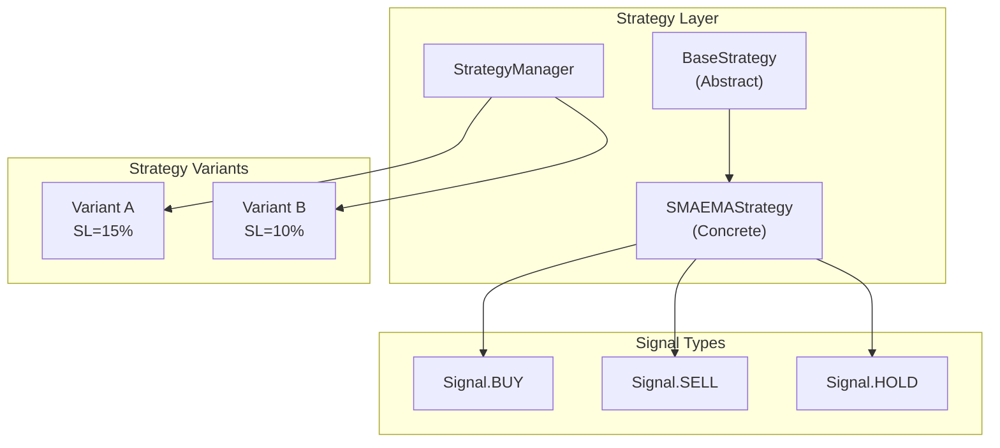
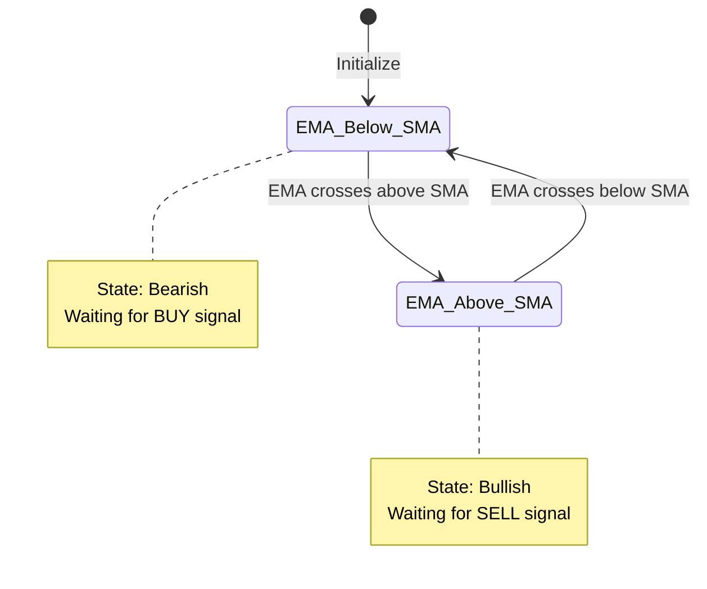
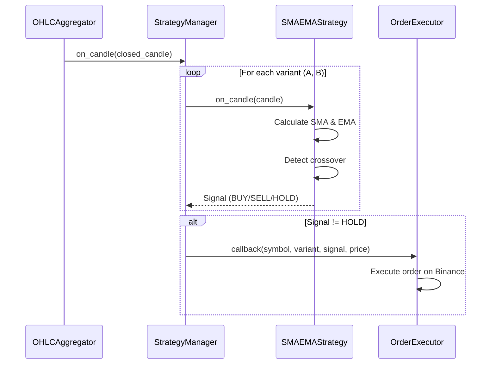

# SMA/EMA Crossover Strategy - Deep Technical Documentation

## ✅ Implementation Status: COMPLETE

Yes, the SMA/EMA-based trading strategy has been **fully implemented**. This document provides an in-depth technical explanation of the strategy logic, parameterization, and architecture.

---

## 📁 File Locations

| Component | File Path |
|-----------|-----------|
| Strategy Manager | `strategy/strategy_manager.py` |
| SMA/EMA Strategy | `strategy/sma_ema_strategy.py` |
| Base Strategy | `strategy/base_strategy.py` |
| Configuration | `config.py` |

---

## 🏗️ Architecture Overview



---

## 1️⃣ Signal Enum - Trading Actions

### Location
```
strategy/base_strategy.py
```

```python
class Signal(Enum):
    BUY = "BUY"    # Enter long position
    SELL = "SELL"  # Exit position / Go flat
    HOLD = "HOLD"  # No action
```

**Trading Logic:**
| Signal | Position State | Action |
|--------|---------------|--------|
| BUY | FLAT → LONG | Place buy order |
| SELL | LONG → FLAT | Place sell order |
| HOLD | No change | Do nothing |

---

## 2️⃣ SMA/EMA Crossover Strategy Logic

### Location
```
strategy/sma_ema_strategy.py
```

### Strategy Rules (Documented in Code)

```python
"""
Strategy Logic:
- Calculate SMA (Simple Moving Average) over N periods
- Calculate EMA (Exponential Moving Average) over M periods  
- BUY signal when EMA crosses above SMA (bullish crossover)
- SELL signal when EMA crosses below SMA (bearish crossover)
"""
```

### Visual Representation

```
Price
  │
  │         ╱╲
  │   EMA ╱    ╲        ← EMA (faster, more responsive)
  │     ╱ ╲    ╱ ╲
  │   ╱    ╲  ╱   ╲
  │ ╱       ╲╱
  │╱   SMA ────────    ← SMA (slower, smoother)
  │
  └──────────────────── Time
       ↑         ↑
   BULLISH   BEARISH
  CROSSOVER  CROSSOVER
   (BUY)      (SELL)
```

---

## 3️⃣ Mathematical Formulas

### Simple Moving Average (SMA)

```python
def _calculate_sma(self, prices: List[float], period: int) -> float:
    if len(prices) < period:
        return 0.0
    return sum(prices[-period:]) / period
```

**Formula:**
```
SMA = (P₁ + P₂ + ... + Pₙ) / N

where:
  P = closing price
  N = period (default: 10)
```

**Example:**
```
Prices: [100, 102, 101, 103, 105, 104, 106, 108, 107, 109]
SMA(10) = (100+102+101+103+105+104+106+108+107+109) / 10
        = 1045 / 10
        = 104.5
```

### Exponential Moving Average (EMA)

```python
def _calculate_ema(self, current_price: float, previous_ema: Optional[float]) -> float:
    if previous_ema is None:
        return current_price  # First EMA = current price
    
    return (current_price * self._ema_multiplier) + (previous_ema * (1 - self._ema_multiplier))
```

**Formula:**
```
EMA = (Price × Multiplier) + (Previous_EMA × (1 - Multiplier))

Multiplier = 2 / (Period + 1)

For EMA(5): Multiplier = 2 / (5 + 1) = 0.333
```

**EMA Weight Decay:**
```
Period 5 EMA weights (most recent first):
  Today:      33.3%
  Yesterday:  22.2%
  Day -2:     14.8%
  Day -3:      9.9%
  Day -4:      6.6%
  ...older:   13.2% cumulative
```

---

## 4️⃣ Crossover Detection Algorithm

### Core Logic

```python
def calculate_signal(self, candles: List[OHLCCandle]) -> Signal:
    # Store previous values
    self._prev_ema = self._current_ema
    self._prev_sma = self._current_sma
    
    # Calculate current values
    self._current_sma = self._calculate_sma(closes, self.sma_period)
    self._current_ema = self._calculate_ema(closes[-1], self._prev_ema)
    
    # Detect crossover
    bullish_crossover = (
        self._prev_ema <= self._prev_sma and  # Was below or equal
        self._current_ema > self._current_sma  # Now above
    )
    
    bearish_crossover = (
        self._prev_ema >= self._prev_sma and  # Was above or equal
        self._current_ema < self._current_sma  # Now below
    )
    
    if bullish_crossover:
        return Signal.BUY
    if bearish_crossover:
        return Signal.SELL
    return Signal.HOLD
```

### State Diagram



---

## 5️⃣ Parameterization

### Configurable Parameters

| Parameter | Default | Location | Description |
|-----------|---------|----------|-------------|
| `sma_period` | 10 | `config.py` | SMA lookback window |
| `ema_period` | 5 | `config.py` | EMA lookback window |
| `variant_a_sl` | 0.15 | `config.py` | Variant A stop loss (15%) |
| `variant_b_sl` | 0.10 | `config.py` | Variant B stop loss (10%) |

### Configuration in `config.py`

```python
class Settings(BaseSettings):
    sma_period: int = Field(default=10, description="SMA lookback period")
    ema_period: int = Field(default=5, description="EMA lookback period")
    variant_a_sl: float = Field(default=0.15, description="Variant A Stop Loss (15%)")
    variant_b_sl: float = Field(default=0.10, description="Variant B Stop Loss (10%)")
```

### Constructor Parameterization

```python
class SMAEMAStrategy(BaseStrategy):
    def __init__(
        self, 
        symbol: str, 
        sma_period: int = 10,      # Configurable
        ema_period: int = 5,       # Configurable
        stop_loss_pct: float = 0.10  # Configurable
    ):
        # Parameter validation
        if sma_period <= 0 or ema_period <= 0:
            raise ValueError("SMA and EMA periods must be positive integers")
```

---

## 6️⃣ Strategy Variants (A/B Risk Levels)

### Variant Configuration

```python
class StrategyManager:
    def __init__(self):
        self.variants = [
            StrategyVariant(
                name="A",
                stop_loss_pct=0.15,  # 15% - Tighter, exits faster
                description="Tighter SL (15%) - Exits faster on loss"
            ),
            StrategyVariant(
                name="B",
                stop_loss_pct=0.10,  # 10% - Looser, allows more drawdown
                description="Looser SL (10%) - Allows more drawdown"
            )
        ]
```

### Per-Symbol Strategy Matrix

```
                    Variant A (SL=15%)    Variant B (SL=10%)
                   ┌─────────────────┐    ┌─────────────────┐
BTCUSDT            │ SMAEMAStrategy  │    │ SMAEMAStrategy  │
                   │ SMA=10, EMA=5   │    │ SMA=10, EMA=5   │
                   └─────────────────┘    └─────────────────┘
                   ┌─────────────────┐    ┌─────────────────┐
ETHUSDT            │ SMAEMAStrategy  │    │ SMAEMAStrategy  │
                   │ SMA=10, EMA=5   │    │ SMA=10, EMA=5   │
                   └─────────────────┘    └─────────────────┘
```

---

## 7️⃣ Position Management

### Position Dataclass

```python
@dataclass
class Position:
    symbol: str
    side: str  # 'LONG' or 'FLAT'
    entry_price: float = 0.0
    entry_time: Optional[datetime] = None
    quantity: float = 0.0
    current_price: float = 0.0
    unrealized_pnl: float = 0.0
    stop_loss_price: float = 0.0
    realized_pnl: float = 0.0
```

### Stop Loss Calculation

```python
def enter_position(self, price: float, quantity: float, timestamp: datetime):
    self.position.entry_price = price
    self.position.stop_loss_price = price * (1 - self.stop_loss_pct)
    # Example: Entry at $100, SL=10% → Stop at $90
```

### Stop Loss Check

```python
def is_stop_loss_triggered(self) -> bool:
    if self.side == "LONG" and self.current_price > 0:
        return self.current_price <= self.stop_loss_price
    return False
```

---

## 8️⃣ Signal Flow Through the System

### Sequence Diagram



### on_candle() Processing

```python
def on_candle(self, candle: OHLCCandle) -> Optional[Signal]:
    # 1. Add candle to history
    self.candle_history.append(candle)
    
    # 2. Trim history to avoid memory bloat
    max_history = self.get_required_candles() * 2
    if len(self.candle_history) > max_history:
        self.candle_history = self.candle_history[-max_history:]
    
    # 3. Update position with current price
    self.position.update_price(candle.close)
    
    # 4. Check stop loss BEFORE signal calculation
    if self.position.is_stop_loss_triggered():
        return Signal.SELL  # Emergency exit
    
    # 5. Calculate trading signal
    if len(self.candle_history) >= self.get_required_candles():
        return self.calculate_signal(self.candle_history)
    
    return Signal.HOLD
```

---

## 9️⃣ Minimum Candles Required

### Calculation

```python
def get_required_candles(self) -> int:
    return max(self.sma_period, self.ema_period) + 1
    # For SMA=10, EMA=5: max(10, 5) + 1 = 11 candles
```

**Why +1?**
- Need previous values to detect **crossover**
- Crossover = state change between two consecutive candles

---

## 🔟 Indicator Access (for APIs)

### get_indicators() Method

```python
def get_indicators(self) -> dict:
    return {
        "sma": self._current_sma,      # Current SMA value
        "ema": self._current_ema,      # Current EMA value
        "sma_period": self.sma_period, # SMA period
        "ema_period": self.ema_period  # EMA period
    }
```

### REST API Access

```bash
GET /api/strategy/status

# Response:
{
  "symbols": ["BTCUSDT", "ETHUSDT"],
  "variants": [
    {"name": "A", "stop_loss_pct": 0.15},
    {"name": "B", "stop_loss_pct": 0.10}
  ],
  "parameters": {
    "sma_period": 10,
    "ema_period": 5
  },
  "positions": {
    "BTCUSDT": {
      "A": {
        "position": {"side": "LONG", "entry_price": 95000},
        "indicators": {"sma": 94800, "ema": 95100}
      }
    }
  }
}
```

---

## Summary

The SMA/EMA strategy is **fully implemented** with:

| Requirement | Implementation |
|-------------|---------------|
| ✅ SMA/EMA calculation | `_calculate_sma()` and `_calculate_ema()` methods |
| ✅ Crossover detection | Bullish/bearish crossover logic in `calculate_signal()` |
| ✅ BUY/SELL/HOLD signals | `Signal` enum with three values |
| ✅ Parameterized lookbacks | `sma_period`, `ema_period` constructor args |
| ✅ Stop loss variants | Variant A (15%) and Variant B (10%) |
| ✅ Clear documentation | Docstrings in code + this read4.md |
