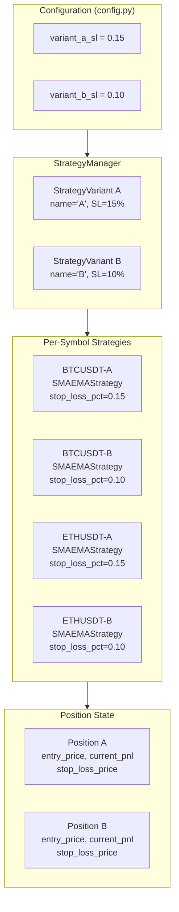
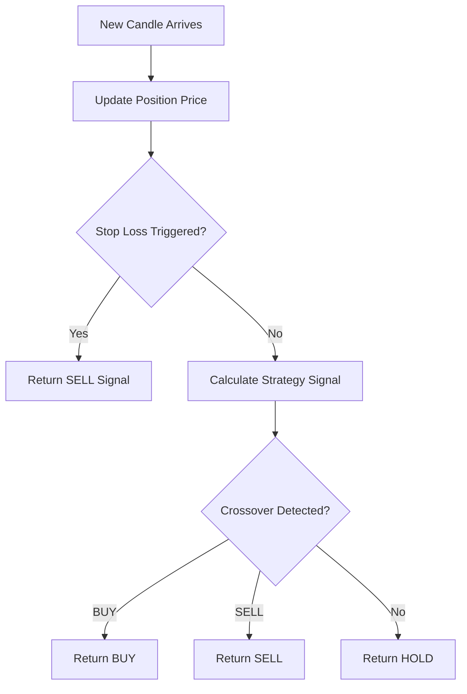

# Strategy Variants (A/B Stop Loss) - Deep Technical Documentation

## ✅ Implementation Status: COMPLETE

Yes, the two strategy variants with different Stop Loss (SL) levels have been **fully implemented**. This document provides an in-depth technical explanation of the variant architecture, position tracking, and SL trigger mechanisms.

---

## 📁 File Locations

| Component | File Path |
|-----------|-----------|
| Strategy Manager | `strategy/strategy_manager.py` |
| Strategy Variant | `strategy/strategy_manager.py` (StrategyVariant class) |
| Position Tracking | `strategy/base_strategy.py` (Position class) |
| SL Logic | `strategy/base_strategy.py` (BaseStrategy class) |

---

## 🏗️ Architecture Overview



---

## 1️⃣ StrategyVariant Definition

### Location
```
strategy/strategy_manager.py
```

```python
@dataclass
class StrategyVariant:
    """
    Represents a strategy variant with specific parameters.
    """
    name: str              # 'A' or 'B'
    stop_loss_pct: float   # 0.15 (15%) or 0.10 (10%)
    description: str       # Human-readable description
```

### Variant Initialization

```python
class StrategyManager:
    def __init__(self):
        self.variants = [
            StrategyVariant(
                name="A",
                stop_loss_pct=self.settings.variant_a_sl,  # 0.15 = 15%
                description="Tighter SL (15%) - Exits faster on loss"
            ),
            StrategyVariant(
                name="B",
                stop_loss_pct=self.settings.variant_b_sl,  # 0.10 = 10%
                description="Looser SL (10%) - Allows more drawdown"
            )
        ]
```

---

## 2️⃣ Stop Loss Comparison

| Variant | Stop Loss | Behavior | Risk Profile |
|---------|-----------|----------|--------------|
| **A** | 15% | Exits earlier on drawdown | Lower max loss, more false exits |
| **B** | 10% | Allows more price fluctuation | Higher max loss, fewer false exits |

### Example Scenario

```
Entry Price: $100,000 (BTC)

Variant A (SL=15%):
  Stop Loss Price = $100,000 × (1 - 0.15) = $85,000
  Triggered when price drops to $85,000

Variant B (SL=10%):  
  Stop Loss Price = $100,000 × (1 - 0.10) = $90,000
  Triggered when price drops to $90,000

If price drops to $88,000:
  - Variant B: STOP LOSS TRIGGERED → Exits position
  - Variant A: Still holding (price above $85,000)
```

---

## 3️⃣ Per-Variant Strategy Creation

### Strategy Matrix Key

```python
# Key format: (symbol, variant_name)
self.strategies: Dict[Tuple[str, str], SMAEMAStrategy] = {}

# Example keys:
# ("BTCUSDT", "A") → Strategy for BTC with 15% SL
# ("BTCUSDT", "B") → Strategy for BTC with 10% SL
# ("ETHUSDT", "A") → Strategy for ETH with 15% SL
# ("ETHUSDT", "B") → Strategy for ETH with 10% SL
```

### Creation Logic

```python
def _create_strategies_for_symbol(self, symbol: str) -> None:
    symbol = symbol.upper()
    for variant in self.variants:
        key = (symbol, variant.name)
        self.strategies[key] = SMAEMAStrategy(
            symbol=symbol,
            sma_period=self.sma_period,
            ema_period=self.ema_period,
            stop_loss_pct=variant.stop_loss_pct  # Variant-specific SL
        )
```

---

## 4️⃣ Position State Tracking

### Position Dataclass

```python
@dataclass
class Position:
    symbol: str
    side: str              # 'LONG' or 'FLAT'
    entry_price: float     # Price at position entry
    entry_time: datetime   # Timestamp of entry
    quantity: float        # Position size
    current_price: float   # Latest market price
    unrealized_pnl: float  # Floating P&L
    stop_loss_price: float # SL trigger price
    realized_pnl: float    # Closed trade P&L
```

### Position State Per Variant

```
BTCUSDT Positions:

┌─────────────────────────────────────────────────────────────┐
│ Variant A (SL=15%)                                          │
├─────────────────────────────────────────────────────────────┤
│ side: LONG                                                  │
│ entry_price: $95,000                                        │
│ stop_loss_price: $80,750 (= $95,000 × 0.85)                │
│ current_price: $96,500                                      │
│ unrealized_pnl: +$1,500 × quantity                         │
└─────────────────────────────────────────────────────────────┘

┌─────────────────────────────────────────────────────────────┐
│ Variant B (SL=10%)                                          │
├─────────────────────────────────────────────────────────────┤
│ side: LONG                                                  │
│ entry_price: $95,000                                        │
│ stop_loss_price: $85,500 (= $95,000 × 0.90)                │
│ current_price: $96,500                                      │
│ unrealized_pnl: +$1,500 × quantity                         │
└─────────────────────────────────────────────────────────────┘
```

---

## 5️⃣ P&L Calculation

### Unrealized P&L (Floating)

```python
def update_price(self, price: float) -> None:
    self.current_price = price
    if self.side == "LONG" and self.entry_price > 0:
        self.unrealized_pnl = (price - self.entry_price) * self.quantity
```

**Formula:**
```
Unrealized P&L = (Current Price - Entry Price) × Quantity

Example:
  Entry: $95,000, Current: $96,500, Qty: 0.1 BTC
  Unrealized P&L = ($96,500 - $95,000) × 0.1 = +$150
```

### Realized P&L (Closed Trade)

```python
def exit_position(self, price: float) -> float:
    if self.side == "LONG":
        pnl = (price - self.entry_price) * self.quantity
        self.realized_pnl += pnl
        return pnl
    return 0.0
```

---

## 6️⃣ Stop Loss Trigger Mechanism

### SL Price Calculation on Entry

```python
def enter_position(self, price: float, quantity: float, timestamp: datetime):
    self.position.entry_price = price
    self.position.stop_loss_price = price * (1 - self.stop_loss_pct)
    
    # Variant A: stop_loss_price = price × 0.85
    # Variant B: stop_loss_price = price × 0.90
```

### SL Trigger Check

```python
def is_stop_loss_triggered(self) -> bool:
    if self.side == "LONG" and self.current_price > 0 and self.stop_loss_price > 0:
        return self.current_price <= self.stop_loss_price
    return False
```

### Integration in Candle Processing

```python
def on_candle(self, candle: OHLCCandle) -> Optional[Signal]:
    # Update position with current price
    self.position.update_price(candle.close)
    
    # CHECK STOP LOSS BEFORE STRATEGY SIGNAL
    if self.position.is_stop_loss_triggered():
        return Signal.SELL  # Emergency exit
    
    # Normal signal calculation
    return self.calculate_signal(self.candle_history)
```

### Flow Diagram



---

## 7️⃣ Accessing Per-Variant State

### Get Position for Specific Variant

```python
def get_position(self, symbol: str, variant_name: str) -> Optional[Position]:
    key = (symbol.upper(), variant_name)
    strategy = self.strategies.get(key)
    return strategy.get_position() if strategy else None

# Usage:
position_a = manager.get_position("BTCUSDT", "A")
position_b = manager.get_position("BTCUSDT", "B")
```

### Get All Positions

```python
def get_all_positions(self) -> Dict[str, Dict[str, Position]]:
    positions = {}
    for (symbol, variant_name), strategy in self.strategies.items():
        if symbol not in positions:
            positions[symbol] = {}
        positions[symbol][variant_name] = strategy.get_position()
    return positions

# Returns:
# {
#   "BTCUSDT": {"A": Position(...), "B": Position(...)},
#   "ETHUSDT": {"A": Position(...), "B": Position(...)}
# }
```

### Comprehensive Status

```python
def get_status(self) -> dict:
    return {
        "symbols": self.get_symbols(),
        "variants": [v.to_dict() for v in self.variants],
        "positions": {
            symbol: {
                variant: {
                    "position": strategy.get_position().to_dict(),
                    "indicators": strategy.get_indicators()
                }
            }
        },
        "parameters": {
            "sma_period": self.sma_period,
            "ema_period": self.ema_period
        }
    }
```

---

## 8️⃣ REST API Access

### Endpoint

```bash
GET /api/strategy/status
```

### Response Example

```json
{
  "symbols": ["BTCUSDT", "ETHUSDT"],
  "variants": [
    {"name": "A", "stop_loss_pct": 0.15, "description": "Tighter SL (15%)"},
    {"name": "B", "stop_loss_pct": 0.10, "description": "Looser SL (10%)"}
  ],
  "parameters": {
    "sma_period": 10,
    "ema_period": 5
  },
  "positions": {
    "BTCUSDT": {
      "A": {
        "position": {
          "side": "LONG",
          "entry_price": 95000.0,
          "stop_loss_price": 80750.0,
          "current_price": 96500.0,
          "unrealized_pnl": 150.0
        },
        "indicators": {"sma": 94800.5, "ema": 95200.3}
      },
      "B": {
        "position": {
          "side": "LONG",
          "entry_price": 95000.0,
          "stop_loss_price": 85500.0,
          "current_price": 96500.0,
          "unrealized_pnl": 150.0
        },
        "indicators": {"sma": 94800.5, "ema": 95200.3}
      }
    }
  }
}
```

---

## 9️⃣ Configuration

### Environment Variables (`.env`)

```env
VARIANT_A_SL=0.15
VARIANT_B_SL=0.10
```

### config.py Defaults

```python
variant_a_sl: float = Field(default=0.15, description="Variant A Stop Loss (15%)")
variant_b_sl: float = Field(default=0.10, description="Variant B Stop Loss (10%)")
```

---

## Summary

The two strategy variants are **fully implemented** with:

| Requirement | Implementation |
|-------------|---------------|
| ✅ Variant A: SL 15% | `StrategyVariant(name="A", stop_loss_pct=0.15)` |
| ✅ Variant B: SL 10% | `StrategyVariant(name="B", stop_loss_pct=0.10)` |
| ✅ Per-variant position state | `Position` dataclass per strategy instance |
| ✅ Entry price tracking | `position.entry_price` |
| ✅ Current P&L tracking | `position.unrealized_pnl` (floating), `position.realized_pnl` (closed) |
| ✅ SL trigger detection | `is_stop_loss_triggered()` returns `True` when `price <= stop_loss_price` |
