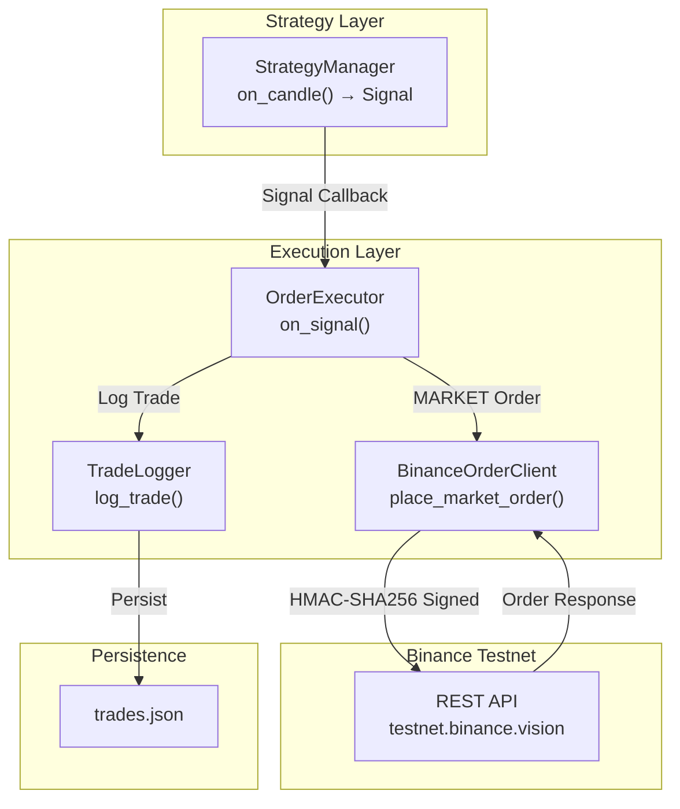
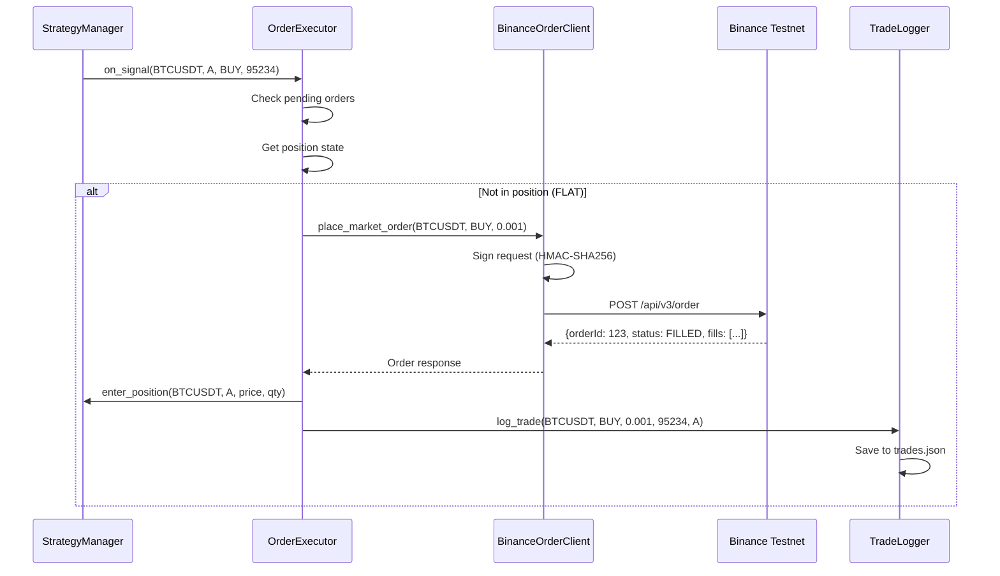

# Sample Order Execution (Binance Testnet) - Deep Technical Documentation

## ✅ Implementation Status: COMPLETE

Yes, the Sample Order Execution on Binance Testnet has been **fully implemented**. This document provides an in-depth technical explanation of the order execution system, API authentication, and trade logging.

---

## 📁 File Locations

| Component | File Path |
|-----------|-----------|
| Order Executor | `execution/order_executor.py` |
| Binance Client | `execution/binance_order_client.py` |
| Trade Logger | `execution/trade_logger.py` |
| Configuration | `config.py` |
| Environment | `.env` |

---

## 🏗️ Architecture Overview



---

## 1️⃣ API Credentials Configuration

### Environment Variables (`.env`)

```env
# NEVER hard-coded - loaded from environment
BINANCE_API_KEY=your_testnet_api_key_here
BINANCE_API_SECRET=your_testnet_api_secret_here
```

### Loading in `config.py`

```python
class Settings(BaseSettings):
    binance_api_key: str = Field(default="", description="Binance Testnet API Key")
    binance_api_secret: str = Field(default="", description="Binance Testnet API Secret")
    
    binance_rest_url: str = Field(
        default="https://testnet.binance.vision/api",
        description="Binance Testnet REST API URL"
    )
    
    class Config:
        env_file = ".env"  # Load from .env file
        env_file_encoding = "utf-8"
```

### Access in BinanceOrderClient

```python
class BinanceOrderClient:
    def __init__(self, api_key=None, api_secret=None):
        self.settings = get_settings()
        
        # Load from config (which loads from env)
        self.api_key = api_key or self.settings.binance_api_key
        self.api_secret = api_secret or self.settings.binance_api_secret
```

---

## 2️⃣ Request Signing (HMAC-SHA256)

### Signature Algorithm

```python
def _sign_request(self, params: Dict[str, Any]) -> Dict[str, Any]:
    # 1. Add timestamp (milliseconds since epoch)
    params["timestamp"] = int(time.time() * 1000)
    
    # 2. Create query string from params
    query_string = urlencode(params)
    
    # 3. Sign with HMAC-SHA256
    signature = hmac.new(
        self.api_secret.encode("utf-8"),
        query_string.encode("utf-8"),
        hashlib.sha256
    ).hexdigest()
    
    # 4. Add signature to params
    params["signature"] = signature
    return params
```

### Signing Flow Diagram

```
┌──────────────────────────────────────────────────────────────┐
│ Original Params                                              │
│ {"symbol": "BTCUSDT", "side": "BUY", "type": "MARKET",      │
│  "quantity": 0.001}                                          │
└──────────────────────────────────────────────────────────────┘
                              ↓
┌──────────────────────────────────────────────────────────────┐
│ Add Timestamp                                                │
│ {"symbol": "BTCUSDT", ..., "timestamp": 1706943600000}      │
└──────────────────────────────────────────────────────────────┘
                              ↓
┌──────────────────────────────────────────────────────────────┐
│ Create Query String                                          │
│ "symbol=BTCUSDT&side=BUY&type=MARKET&quantity=0.001&        │
│  timestamp=1706943600000"                                    │
└──────────────────────────────────────────────────────────────┘
                              ↓
┌──────────────────────────────────────────────────────────────┐
│ HMAC-SHA256(query_string, api_secret)                        │
│ → "a3b4c5d6e7f8..."  (64 hex characters)                    │
└──────────────────────────────────────────────────────────────┘
                              ↓
┌──────────────────────────────────────────────────────────────┐
│ Final Request                                                │
│ POST /api/v3/order                                          │
│ Headers: {"X-MBX-APIKEY": "your_api_key"}                   │
│ Body: {..., "signature": "a3b4c5d6e7f8..."}                 │
└──────────────────────────────────────────────────────────────┘
```

---

## 3️⃣ Market Order Execution

### Order Placement

```python
async def place_market_order(
    self,
    symbol: str,
    side: str,
    quantity: float
) -> Dict[str, Any]:
    params = {
        "symbol": symbol.upper(),   # BTCUSDT
        "side": side.upper(),       # BUY or SELL
        "type": "MARKET",           # Market order (immediate execution)
        "quantity": quantity        # 0.001 BTC
    }
    
    response = await self._request("POST", "/v3/order", params, signed=True)
    return response
```

### Binance Response Format

```json
{
  "symbol": "BTCUSDT",
  "orderId": 1234567890,
  "clientOrderId": "abc123",
  "transactTime": 1706943600123,
  "price": "0.00000000",
  "origQty": "0.00100000",
  "executedQty": "0.00100000",
  "status": "FILLED",
  "type": "MARKET",
  "side": "BUY",
  "fills": [
    {
      "price": "95234.50000000",
      "qty": "0.00100000",
      "commission": "0.00000000",
      "commissionAsset": "BTC"
    }
  ]
}
```

---

## 4️⃣ Order Sizes (Dummy Values)

### Configuration

```python
# config.py
order_size_btc: float = Field(default=0.001, description="Order size for BTC pairs")
order_size_eth: float = Field(default=0.01, description="Order size for ETH pairs")
```

### Dynamic Size Selection

```python
def _get_order_size(self, symbol: str) -> float:
    symbol = symbol.upper()
    
    if symbol.startswith("BTC"):
        return self._order_sizes.get("BTC", 0.001)  # 0.001 BTC ≈ $95
    elif symbol.startswith("ETH"):
        return self._order_sizes.get("ETH", 0.01)   # 0.01 ETH ≈ $25
    else:
        return 0.001  # Default small quantity
```

---

## 5️⃣ Order Executor - Signal to Order Flow

### Signal Callback Registration

```python
# In main.py
self.strategy_manager.add_signal_callback(self.order_executor.on_signal)
```

### Signal Processing

```python
def on_signal(self, symbol: str, variant: str, signal: Signal, price: float):
    if signal != Signal.HOLD:
        asyncio.create_task(
            self.execute_signal(symbol, variant, signal, price)
        )

async def execute_signal(self, symbol, variant, signal, price):
    # Prevent duplicate execution
    key = f"{symbol}_{variant}"
    if self._pending_orders.get(key):
        return None
    
    try:
        self._pending_orders[key] = True
        
        position = self.strategy_manager.get_position(symbol, variant)
        
        if signal == Signal.BUY:
            return await self._execute_buy(symbol, variant, price, position)
        elif signal == Signal.SELL:
            return await self._execute_sell(symbol, variant, price, position)
    finally:
        self._pending_orders[key] = False
```

### Execution Flow Diagram



---

## 6️⃣ Trade Logger

### Trade Record Format

```python
def log_trade(
    self,
    symbol: str,      # "BTCUSDT"
    side: str,        # "BUY" or "SELL"
    size: float,      # 0.001
    price: float,     # 95234.50
    variant: str,     # "A" or "B"
    order_id: str,    # "1234567890"
    status: str,      # "FILLED"
    pnl: float,       # None for BUY, calculated for SELL
    notes: str        # "SMA/EMA crossover entry"
) -> Dict[str, Any]:
    trade = {
        "timestamp": datetime.utcnow().isoformat(),  # UTC timestamp
        "symbol": symbol.upper(),
        "side": side.upper(),
        "size": size,
        "price": price,
        "variant": variant,
        "order_id": order_id,
        "status": status,
        "pnl": pnl,
        "notes": notes
    }
    
    with self._lock:
        self._trades.append(trade)
        self._save_trades()  # Persist to JSON
    
    return trade
```

### Sample `trades.json`

```json
[
  {
    "timestamp": "2026-02-03T13:45:00.123456",
    "symbol": "BTCUSDT",
    "side": "BUY",
    "size": 0.001,
    "price": 95234.50,
    "variant": "A",
    "order_id": "1234567890",
    "status": "FILLED",
    "pnl": null,
    "notes": "SMA/EMA crossover entry"
  },
  {
    "timestamp": "2026-02-03T14:20:00.654321",
    "symbol": "BTCUSDT",
    "side": "SELL",
    "size": 0.001,
    "price": 95500.00,
    "variant": "A",
    "order_id": "1234567891",
    "status": "FILLED",
    "pnl": 0.26555,
    "notes": "SMA/EMA crossover exit"
  }
]
```

---

## 7️⃣ Trade Summary Statistics

### Summary Calculation

```python
def get_summary(self, symbol=None, variant=None) -> Dict[str, Any]:
    trades = self.get_trades(symbol=symbol, variant=variant)
    
    buy_trades = [t for t in trades if t["side"] == "BUY"]
    sell_trades = [t for t in trades if t["side"] == "SELL"]
    
    pnl_trades = [t for t in trades if t.get("pnl") is not None]
    total_pnl = sum(t["pnl"] for t in pnl_trades)
    winning = len([t for t in pnl_trades if t["pnl"] > 0])
    losing = len([t for t in pnl_trades if t["pnl"] < 0])
    
    return {
        "total_trades": len(trades),
        "buy_trades": len(buy_trades),
        "sell_trades": len(sell_trades),
        "total_pnl": total_pnl,
        "winning_trades": winning,
        "losing_trades": losing,
        "win_rate": winning / len(pnl_trades) if pnl_trades else 0.0
    }
```

---

## 8️⃣ REST API Endpoints for Trades

### Trade History

```bash
GET /api/trades?symbol=BTCUSDT&variant=A&limit=50

# Response:
{
  "trades": [
    {
      "timestamp": "2026-02-03T13:45:00.123456",
      "symbol": "BTCUSDT",
      "side": "BUY",
      "size": 0.001,
      "price": 95234.50,
      "variant": "A",
      "order_id": "1234567890",
      "status": "FILLED"
    }
  ],
  "count": 1
}
```

### Trade Summary

```bash
GET /api/trades/summary?symbol=BTCUSDT

# Response:
{
  "total_trades": 10,
  "buy_trades": 5,
  "sell_trades": 5,
  "total_pnl": 1.2345,
  "winning_trades": 3,
  "losing_trades": 2,
  "win_rate": 0.6
}
```

---

## 9️⃣ Error Handling

### Credential Validation

```python
if not self.api_key or not self.api_secret:
    logger.error("Cannot place order: API credentials not configured")
    return {"error": "API credentials not configured"}
```

### Duplicate Order Prevention

```python
def on_signal(self, symbol, variant, signal, price):
    key = f"{symbol}_{variant}"
    if self._pending_orders.get(key):
        logger.warning(f"Order already pending for {key}")
        return None
```

### API Error Handling

```python
async with session.post(url, data=params, headers=headers) as response:
    data = await response.json()
    if response.status != 200:
        logger.error(f"API error: {data}")
    return data
```

---

## Summary

The Order Execution system is **fully implemented** with:

| Requirement | Implementation |
|-------------|---------------|
| ✅ Binance Testnet REST API | `BinanceOrderClient` with aiohttp |
| ✅ Market orders | `place_market_order()` |
| ✅ Small dummy sizes | 0.001 BTC, 0.01 ETH configurable |
| ✅ Credentials from env | `Settings` loads from `.env` file |
| ✅ HMAC-SHA256 signing | `_sign_request()` method |
| ✅ Trade log with all fields | `TradeLogger` → `trades.json` |
| ✅ Timestamp, symbol, side | All fields in trade record |
| ✅ Size, price, variant | All fields in trade record |
